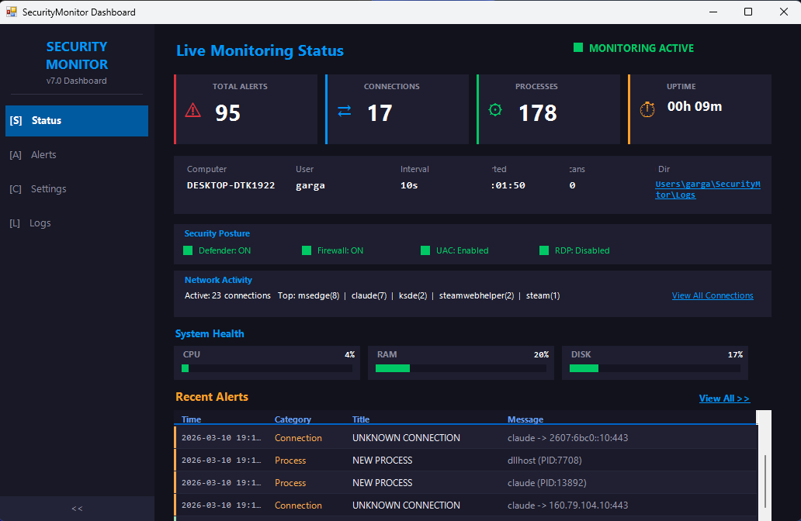

# SecurityMonitor - Real-Time Security Monitoring Dashboard

A PowerShell-based security monitoring tool with a modern dark-themed WinForms dashboard. Performs continuous system-level monitoring including network connections, processes, drivers, services, registry tampering, and **AI-powered threat detection** — all running locally with no cloud dependency.



## Quick Install

Open PowerShell as Administrator and paste:

```powershell
powershell -ExecutionPolicy Bypass -Command "[Net.ServicePointManager]::SecurityProtocol=[Net.SecurityProtocolType]::Tls12; Invoke-WebRequest 'https://raw.githubusercontent.com/xyzwebmaster/SecurityMonitor/master/Install.ps1' -OutFile '$env:TEMP\SM_Install.ps1' -UseBasicParsing; & '$env:TEMP\SM_Install.ps1'"
```

This single command downloads the full project, installs [HollowsHunter](https://github.com/hasherezade/hollows_hunter) for AI memory scanning, creates a scheduled task, desktop shortcut, and starts monitoring immediately.

## Features

### Dashboard UI
- **Modern Dark Theme**: Tabbed WinForms interface with collapsible sidebar navigation (`<<` / `>>`)
- **5 Tabs**: Status, Alerts, AI Threats (optional), Settings, Logs
- **Live Status Page**: 4 stat cards (Total Alerts, Connections, Processes, Uptime), CPU/RAM/Disk gauges, Security Posture panel (Defender, Firewall, UAC, RDP), Network Activity summary, AI Detection summary, and Recent Alerts preview
- **Responsive Layout**: All panels, stat cards, gauge bars, ListViews, and detail panels resize proportionally with the window
- **System Tray**: Minimizes to tray with NotifyIcon; balloon/toast notifications; single-instance detection via named mutex
- **OwnerDraw ListViews**: Custom-rendered rows with severity color coding, alternating row colors, and accent bars

### Alert System
- **Filterable Alert History**: Filter by severity (CRIT/HIGH/MED/LOW/INFO) and category, with keyword search
- **5 Columns**: Time, Severity, Category, Title, Message — all auto-resize with window
- **Detail Panel**: Shows full alert details on selection
- **6 Action Buttons** (context-sensitive, appear based on alert type):
  - **Kill Process** — terminates process by PID, with UAC elevation fallback
  - **Stop/Start Service** — toggles service state with UAC elevation
  - **Block IP** — creates Windows Firewall deny rule for remote IP
  - **Restore Registry** — reverts tampered registry values/keys to expected state
  - **IP Lookup** — opens ipinfo.io for remote IP investigation
  - **Open Alert Log** — opens daily alert log in Notepad
- **Export to CSV**: Export filtered alert history

### AI Threat Detection (Optional)
Enable from Settings tab — off by default to save resources.

- **Behavioral Analysis Engine** (pure PowerShell, fully local):
  - Suspicious parent-child process trees (e.g. Word → cmd.exe, svchost → powershell)
  - Base64/encoded PowerShell command detection
  - Download cradle patterns (Invoke-Expression, DownloadString, WebClient)
  - Windows Defender evasion attempts (exclusion paths, disabling real-time monitoring)
  - Known attack tool detection (mimikatz, rubeus, sharphound, bloodhound, lazagne)
  - Unsigned executables running from suspicious locations (Temp, Downloads, Public, ProgramData)
  - High-entropy (randomized) process name detection
  - Fileless/deleted executable detection (running process with no file on disk)
  - System process masquerading (svchost.exe, lsass.exe, csrss.exe from wrong path)
- **HollowsHunter Integration**: Memory injection scanner — detects process hollowing, DLL injection, IAT hooking, shellcode, inline hooks, and header modifications
- **Self-Exclusion**: Automatically whitelists own PID, parent chain, and child processes to prevent false positives
- **Dedicated AI Threats Tab**: Risk-colored ListView with detail panel and Kill Process button
- **Auto-Scan**: Runs on startup and every 5 minutes when enabled
- **Status Page Panel**: Shows threat count and last scan time with "Scan Now" button

### 10 Monitoring Categories
Each can be independently toggled on/off from the Settings tab:

| Category | Icon | What It Monitors |
|----------|------|-----------------|
| Firmware Integrity | `[FW]` | SHA-256 hash changes of `.sys`, `.efi`, `.rom`, `.bin`, `.fw`, `.cap` files |
| Driver Changes | `[DR]` | New drivers loaded or existing drivers removed |
| New Services | `[SV]` | Newly installed or registered Windows services |
| Network Connections | `[CN]` | Outbound connections from unrecognized processes |
| Unsigned Processes | `[PR]` | Processes without valid digital signatures |
| New Listening Ports | `[LP]` | Ports opened by non-system processes |
| Registry Tampering | `[RG]` | 90+ checks: IFEO debuggers, Defender policies, COM hijacking, startup keys, etc. |
| Security Events | `[SE]` | Remote logons, failed logins, new accounts, new service installs (Event Log) |
| RDP Status | `[RD]` | Remote Desktop enabled/disabled detection |
| Hosts File | `[HF]` | DNS redirection changes in Windows hosts file |

### Settings & Notifications
- **Per-Category Toggles**: Enable/disable each of the 10 monitoring categories
- **Detailed Threat Info**: Optional severity levels and threat/recommendation details (off by default for a neutral, non-alarming experience)
- **Windows Desktop Notifications**: Toggle toast/balloon notifications on/off; alerts always remain accessible in the GUI
- **AI Threat Detection**: Enable/disable with resource usage warning
- **Select All / Deselect All**: Bulk toggle for monitoring categories
- **Instant Save**: All settings persist immediately to `notification_config.json`

### Background Architecture
- **Non-blocking UI**: Heavy I/O (WMI, network, registry scans) runs in background runspaces via synchronized hashtables
- **Dashboard Runspace**: Dedicated thread for CPU/RAM/Disk/Network/Security posture polling (10s interval)
- **Monitor Runspace**: Dedicated thread for all monitoring engines (configurable interval, default 10s)
- **UI Timer**: Fast 2s refresh reads cached data only — never calls WMI/CIM directly

## Requirements

- Windows 10/11
- PowerShell 5.1+
- Administrator privileges

## Installation

### One-Line Install (Recommended)

```powershell
powershell -ExecutionPolicy Bypass -Command "[Net.ServicePointManager]::SecurityProtocol=[Net.SecurityProtocolType]::Tls12; Invoke-WebRequest 'https://raw.githubusercontent.com/xyzwebmaster/SecurityMonitor/master/Install.ps1' -OutFile '$env:TEMP\SM_Install.ps1' -UseBasicParsing; & '$env:TEMP\SM_Install.ps1'"
```

The installer automatically:
1. Downloads the full repository to `%USERPROFILE%\SecurityMonitor\`
2. Downloads [HollowsHunter](https://github.com/hasherezade/hollows_hunter) to `Tools\hollows_hunter.exe`
3. Sets execution policy if needed
4. Creates `Logs\` and `Baselines\` directories
5. Registers a scheduled task (auto-starts at every logon with highest privileges)
6. Starts monitoring immediately

### Local Install

If you already have the files (e.g. via `git clone`):

```powershell
powershell -ExecutionPolicy Bypass -File Install.ps1
```

### Manual Start

Run directly without the installer:

```powershell
powershell -ExecutionPolicy Bypass -File SecurityMonitor.ps1
```

### Desktop Shortcut

The installer creates a desktop shortcut via `Launcher.ps1`, which:
- Starts SecurityMonitor with UAC elevation if not already running
- Opens the dashboard if an instance is already active (signal file mechanism)

## Usage

```powershell
# Interactive mode (dashboard opens)
powershell -ExecutionPolicy Bypass -File SecurityMonitor.ps1

# Silent mode (tray only, no console window)
powershell -ExecutionPolicy Bypass -File SecurityMonitor.ps1 -Silent

# Custom scan interval (seconds)
powershell -ExecutionPolicy Bypass -File SecurityMonitor.ps1 -IntervalSeconds 5
```

## File Structure

```
SecurityMonitor/
├── SecurityMonitor.ps1      # Main monitoring script + dashboard
├── Launcher.ps1             # Desktop shortcut target (UAC + single-instance)
├── Install.ps1              # Installer (downloads deps, creates task/shortcut)
├── notification_config.json # User preferences (auto-generated)
├── Tools/
│   └── hollows_hunter.exe   # AI memory scanner (auto-downloaded by installer)
├── Logs/
│   ├── monitor_YYYY-MM-DD.log      # General monitoring events
│   ├── alerts_YYYY-MM-DD.log       # Security alerts only
│   └── connections_YYYY-MM-DD.log  # Network connection history
├── Baselines/
│   ├── firmware_hashes.json   # Firmware/driver file SHA-256 hashes
│   ├── driver_baseline.json   # Loaded driver snapshot
│   └── service_baseline.json  # Service snapshot
└── screenshots/
    └── dashboard.png
```

## Uninstall

```powershell
# Remove scheduled task
Unregister-ScheduledTask -TaskName "SecurityMonitor" -Confirm:$false

# Remove desktop shortcut
Remove-Item "$env:USERPROFILE\Desktop\SecurityMonitor.lnk" -ErrorAction SilentlyContinue
```

## License

MIT
